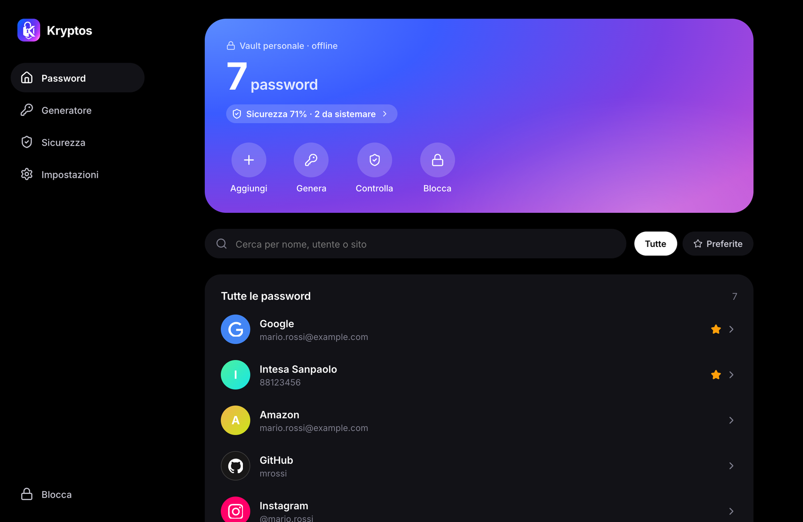
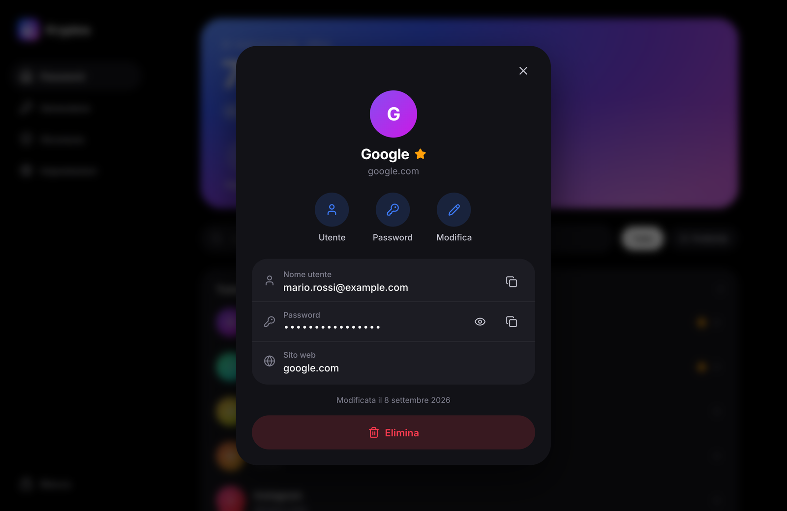
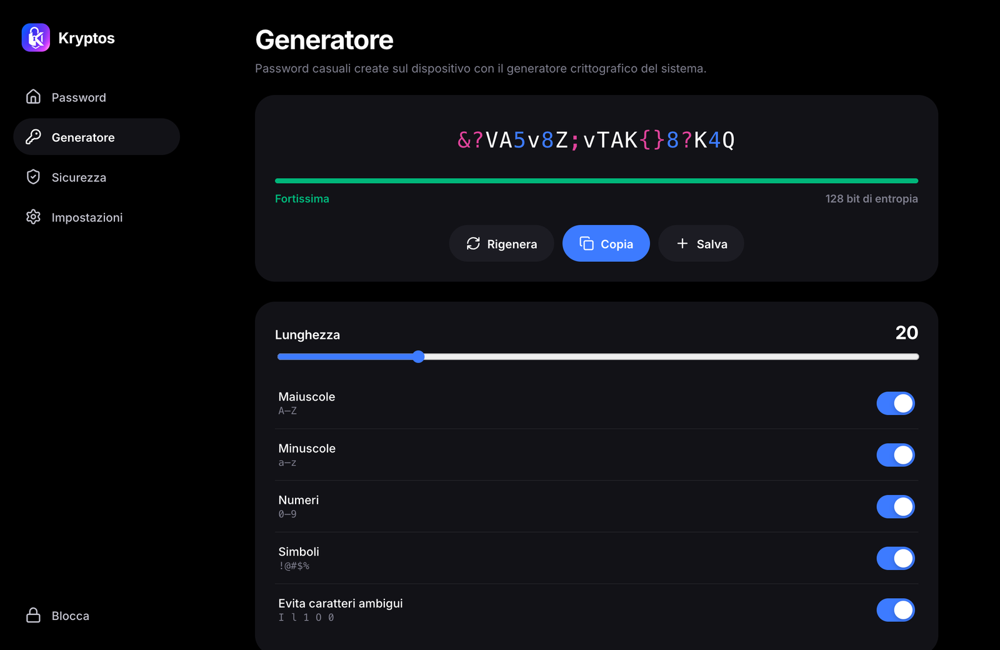
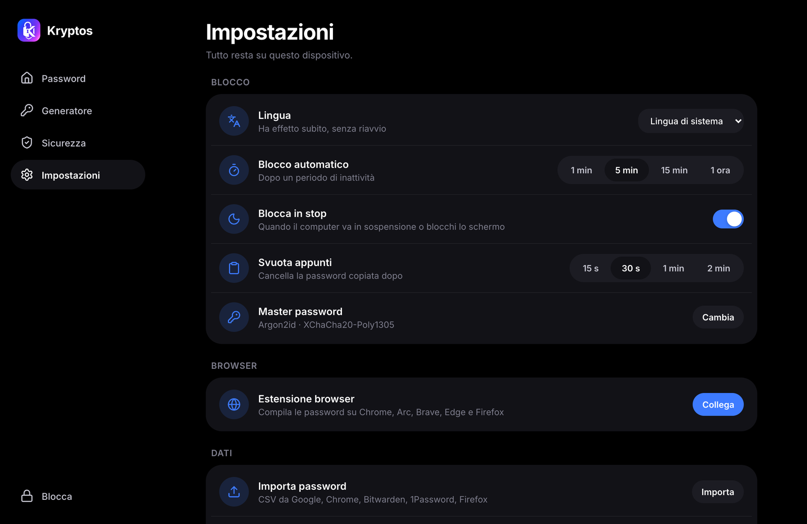
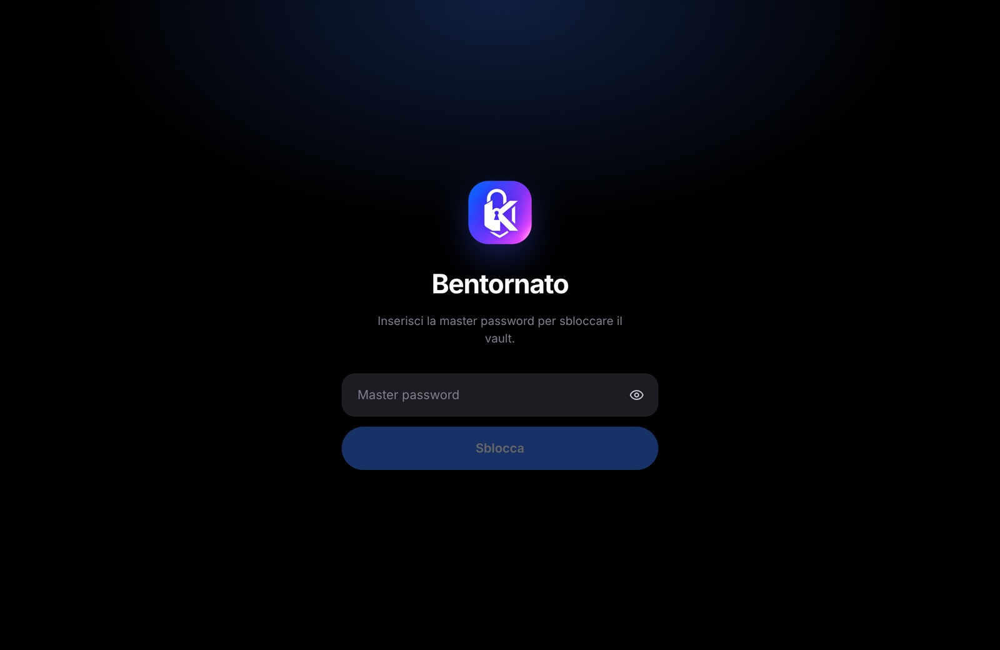
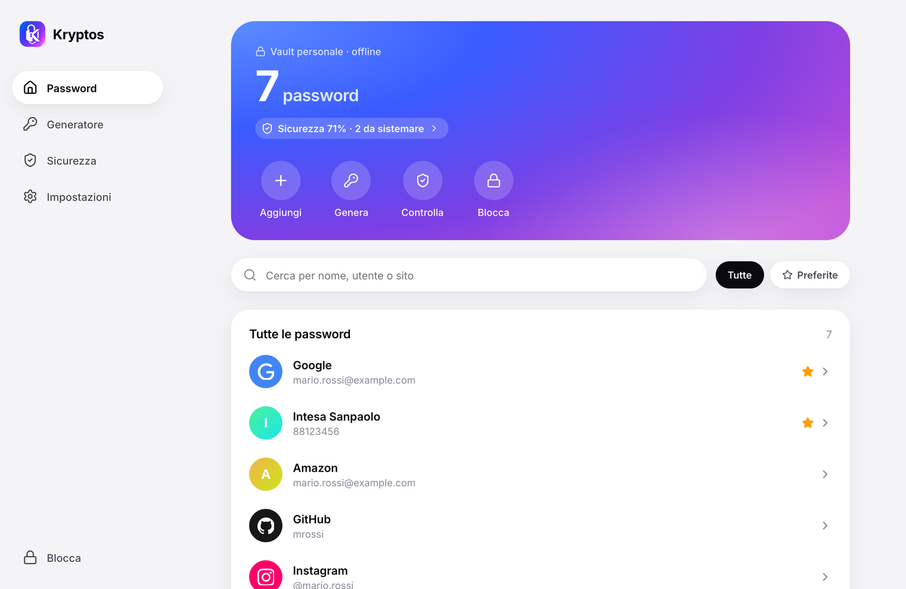
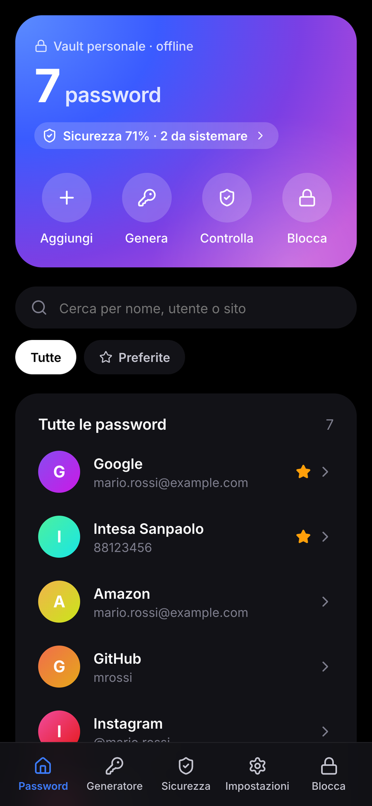
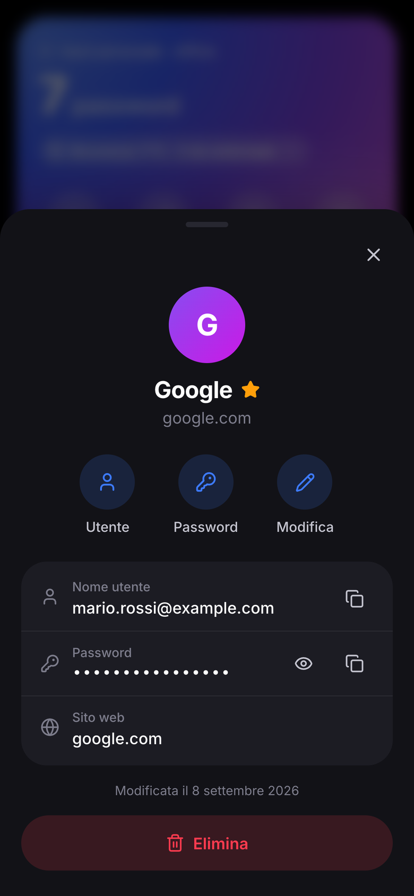
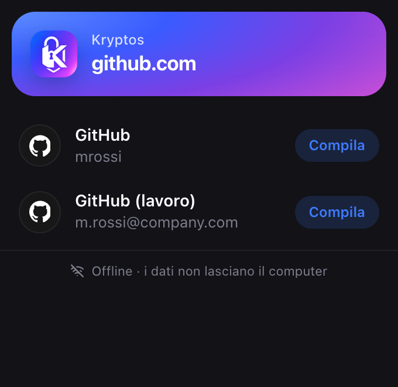

<p align="center">
  
</p>

<p align="center">
  <a href="README.md">English</a> · Italiano
</p>

<h1 align="center">Kryptos</h1>

<p align="center">
  <b>Password manager 100% offline</b> per macOS, Windows, Linux e Android (iOS in arrivo).<br>
  Nessun server, nessun account, nessuna connessione di rete: il vault cifrato resta sul tuo dispositivo.
</p>

<p align="center">
  <a href="LICENSE"></a>
  
  
  
</p>

<p align="center">
  
</p>

Dettagli tecnici e modello di minaccia in [docs/ARCHITECTURE.it.md](docs/ARCHITECTURE.it.md).

> [!WARNING]
> **Versione 0.1: software sperimentale.** Il codice non ha ancora avuto una revisione di sicurezza
> indipendente e alcuni flussi (compilazione nel browser, autofill su Android) sono stati provati solo in
> ambienti di test. Non usarlo come **unica** copia di password importanti: tieni un'altra copia finché il
> progetto non è maturo. Le vulnerabilità vanno segnalate in privato: vedi [SECURITY.md](SECURITY.md).

**Crittografia:** Argon2id (256 MiB su desktop, 64 MiB su mobile) e XChaCha20-Poly1305, con una vault key
casuale cifrata dalla master password. Algoritmi pubblici e standard: la sicurezza dipende dalla tua
master password, non dalla segretezza del codice.

## Screenshot

<table>
  <tr>
    <td></td>
    <td></td>
  </tr>
  <tr>
    <td align="center">Dettaglio: copia sicura, appunti svuotati da soli</td>
    <td align="center">Generatore con entropia in tempo reale</td>
  </tr>
  <tr>
    <td></td>
    <td></td>
  </tr>
  <tr>
    <td align="center">Password deboli, riutilizzate e vecchie, analizzate offline</td>
    <td align="center">Blocco automatico, import CSV, collegamento al browser</td>
  </tr>
  <tr>
    <td></td>
    <td></td>
  </tr>
  <tr>
    <td align="center">Sblocco con master password (Argon2id)</td>
    <td align="center">Tema chiaro, segue quello del sistema</td>
  </tr>
</table>

**Android e estensione browser**

<p align="center">
  
  &nbsp;
  
  &nbsp;
  
</p>

> Gli screenshot usano dati di esempio.

```
crates/core                 Rust: crittografia, vault, generatore, matching URL, import CSV, analisi sicurezza
crates/native-host          Relay Native Messaging (browser ⇄ app), incluso nell'app come sidecar
apps/desktop                App Tauri 2 condivisa desktop + mobile
  src/                      UI React (unica per tutte le piattaforme)
  src-tauri/src/            Comandi Rust, bridge browser (desktop), JNI autofill (Android)
  src-tauri/gen/android/    Progetto Android: AutofillService in Kotlin
extension/                  Estensione browser MV3 (Chrome, Arc, Brave, Edge, Firefox)
apps/desktop/brand/         Logo sorgente + make-icons.py (rigenera tutte le icone)
```

## Sviluppo

Requisiti: Rust (rustup), Node 20+. Per Android: Android Studio (SDK + NDK).

```bash
cd apps/desktop && npm install && npm run tauri dev
```

**Anteprima di design nel browser** (dati finti, niente Rust): `npm run dev`, poi apri
http://127.0.0.1:1420. La master password è `password`.

Test del core:

```bash
cargo test -p kryptos-core
```

### Build

```bash
cd apps/desktop && npx tauri build            # macOS .app / .dmg (include il native host)
```

```bash
cd apps/desktop && npx tauri android build --apk --target aarch64
```

Per Android servono `ANDROID_HOME`, `NDK_HOME` e `JAVA_HOME`. Il JDK incluso in Android Studio va bene:
`/Applications/Android Studio.app/Contents/jbr/Contents/Home`.

**Firma delle release Android.** La chiave si crea una volta sola, fuori dal repository (keytool chiede le password):

```bash
keytool -genkeypair -v -keystore ~/kryptos-release.jks -alias kryptos -keyalg RSA -keysize 4096 -validity 10000
```

Poi crea `apps/desktop/src-tauri/gen/android/keystore.properties` (escluso da git) con `storeFile` (percorso
assoluto del `.jks`), `storePassword`, `keyAlias` e `keyPassword`. La CI può indicare un altro file con
`KRYPTOS_KEYSTORE_PROPERTIES`. Tieni un backup del `.jks` e delle password: gli aggiornamenti vanno firmati con
la stessa chiave. Senza il file, le build di release escono non firmate.

## Cambiare il logo

```bash
cd apps/desktop && python3 brand/make-icons.py /percorso/nuovo-logo.png && npx tauri icon icon.png -o src-tauri/icons && python3 brand/make-icons.py --android-only
```

## Estensione browser

1. `chrome://extensions` → Modalità sviluppatore → *Carica estensione non pacchettizzata* → `extension/`
   (l'ID è fisso: `jclbckdbmecjgoopnpchbijihdfeajkb`)
2. Nell'app: **Impostazioni → Estensione browser → Collega**, poi riavvia il browser
3. Su una pagina di login: clic sull'icona Kryptos, oppure ⌘⇧L

La chiave privata dell'estensione (`secrets/extension-key.pem`) serve solo per pacchettizzare un `.crx`.
Non va condivisa ed è esclusa da git.

## Autofill su Android

Impostazioni Android → Password e account → Servizio di compilazione automatica → **Kryptos**.
Oppure, via adb:

```bash
adb shell settings put secure autofill_service com.kryptos.vault/.KryptosAutofillService
```

## Spostare le password tra dispositivi

Kryptos non ha un server, quindi i dispositivi non si parlano mai via rete. Per portare le password dal
telefono al computer (o viceversa) si sposta una **copia del vault cifrato** e la si unisce:
**Impostazioni → Sincronizza tra dispositivi**.

- **Con un file.** Sul dispositivo che ha le password: *Backup cifrato → Esporta* (su Android anche
  *Condividi*, per mandarlo con Quick Share, Drive, una chat con te stesso…). Sull'altro: *Unisci un
  backup → Scegli file*.
- **Con i codici QR, senza nessun file.** Su un dispositivo: *Invia con i codici QR → Mostra*: il vault
  cifrato compare come una breve sequenza di QR. Sull'altro: *Ricevi con i codici QR → Inquadra*, e punta
  la fotocamera sullo schermo finché la barra non è piena. Comodo dal computer al telefono (per il verso
  opposto serve una fotocamera sul computer).

In entrambi i casi poi inserisci la **master password della copia ricevuta** (di solito è la stessa) e
Kryptos unisce voce per voce: aggiunge quello che ha solo l'altra copia, per le modifiche vince la più
recente e riporta anche le cancellazioni. Niente viene mai sostituito in blocco.

Quello che viaggia è il vault cifrato, esattamente come un backup: chi intercetta il file, o filma i QR,
ha comunque bisogno della master password. Detto questo, non lasciare backup in giro in cartelle condivise.

## Loghi dei siti

Le voci mostrano il logo del sito quando è disponibile. I loghi provengono da
[Simple Icons](https://simpleicons.org) (CC0) e sono inclusi nell'app al momento della build: **nessuna
richiesta di rete viene mai fatta per scaricare un'icona**, quindi nessuno può sapere su quali siti hai
un account. I siti senza logo mantengono l'iniziale colorata. Marchi e loghi appartengono ai rispettivi
proprietari e sono usati solo per identificare i siti.

## Licenza

[GPL-3.0-or-later](LICENSE). Puoi usare, studiare, modificare e ridistribuire Kryptos. Le versioni
modificate che distribuisci devono restare open source con la stessa licenza.
