<p align="center">
  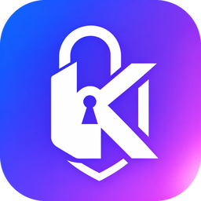
</p>

<p align="center">
  English · <a href="README.it.md">Italiano</a>
</p>

<h1 align="center">Kryptos</h1>

<p align="center">
  <b>100% offline password manager</b> for macOS, Windows, Linux and Android (iOS coming).<br>
  No server, no account, no network connection: the encrypted vault stays on your device.
</p>

<p align="center">
  <a href="LICENSE"></a>
  
  
  
</p>

<p align="center">
  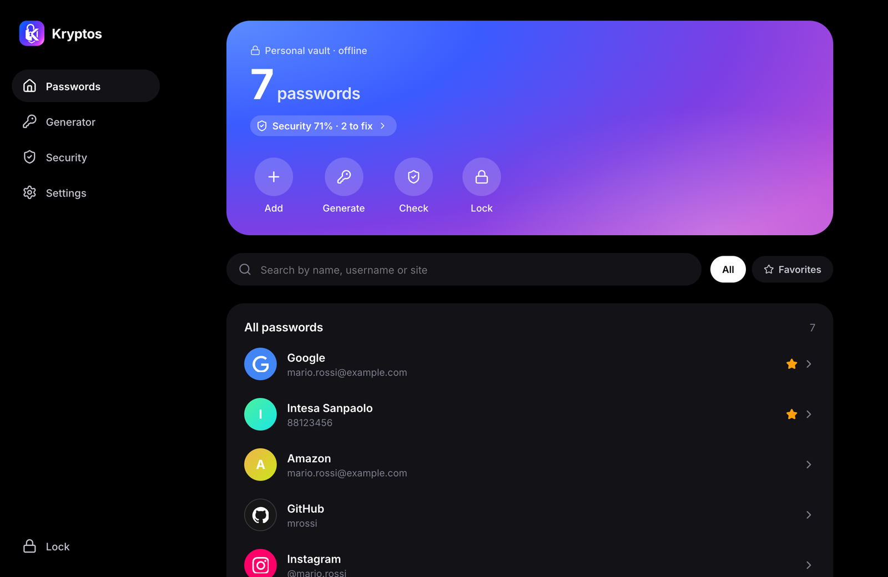
</p>

Technical details and threat model in [docs/ARCHITECTURE.md](docs/ARCHITECTURE.md).

> [!WARNING]
> **Version 0.1: experimental software.** The code hasn't had an independent security review yet, and
> some flows (browser fill, Android autofill) have only been tested in dev environments. Don't use it as
> your **only** copy of important passwords: keep another copy until the project matures. Vulnerabilities
> should be reported privately: see [SECURITY.md](SECURITY.md).

**Encryption:** Argon2id (256 MiB on desktop, 64 MiB on mobile) and XChaCha20-Poly1305, with a random
vault key wrapped by the master password. Public, standard algorithms: security depends on your master
password, not on the secrecy of the code.

## Screenshots

<table>
  <tr>
    <td>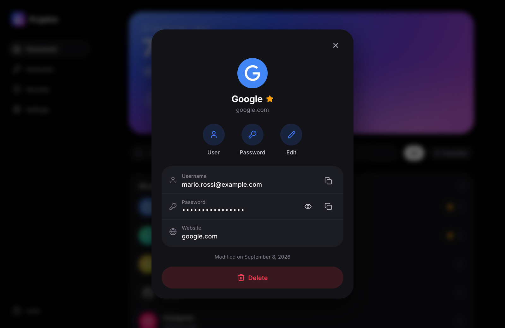</td>
    <td>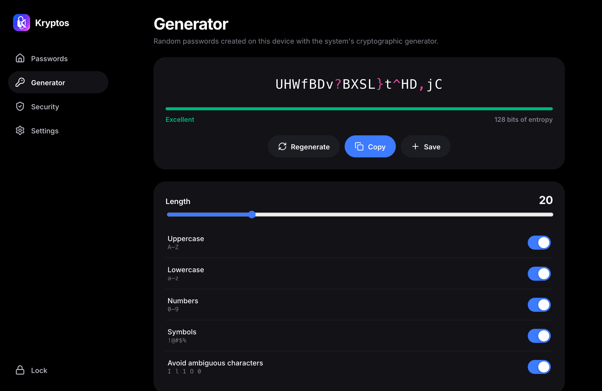</td>
  </tr>
  <tr>
    <td align="center">Detail view: secure copy, clipboard clears itself</td>
    <td align="center">Generator with real-time entropy</td>
  </tr>
  <tr>
    <td>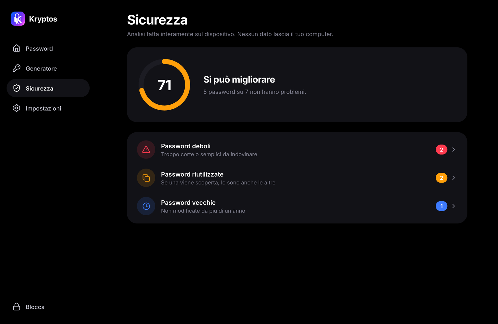</td>
    <td>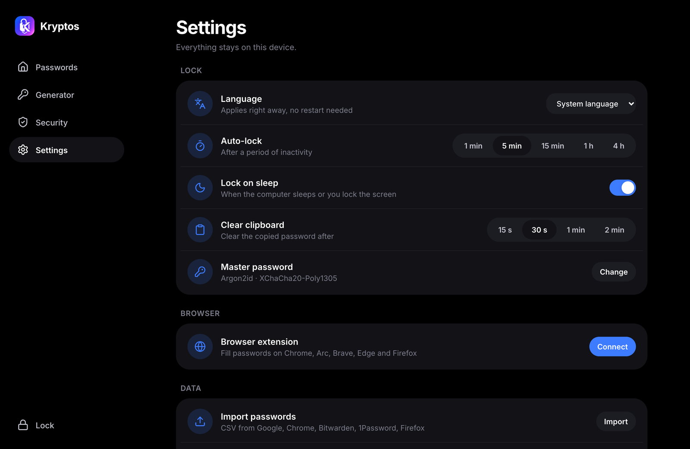</td>
  </tr>
  <tr>
    <td align="center">Weak, reused and old passwords, analyzed offline</td>
    <td align="center">Auto-lock, CSV import, browser connection</td>
  </tr>
  <tr>
    <td>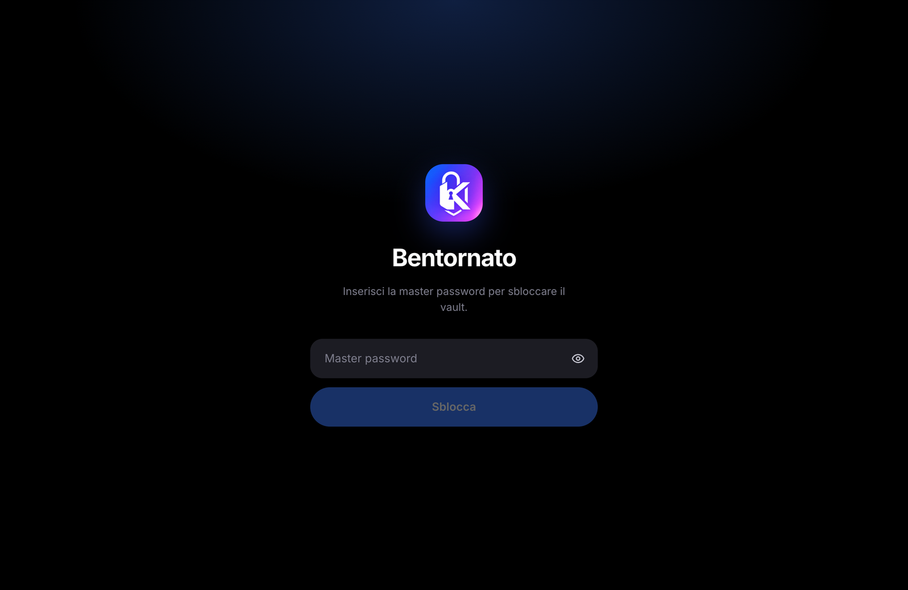</td>
    <td>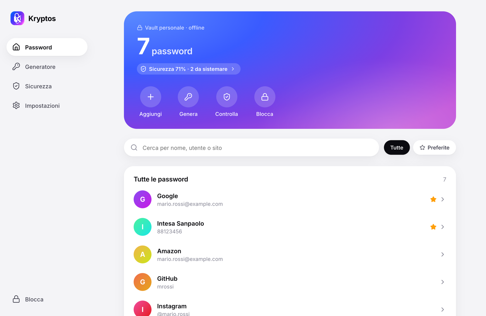</td>
  </tr>
  <tr>
    <td align="center">Unlock with master password (Argon2id)</td>
    <td align="center">Light theme, follows the system</td>
  </tr>
</table>

**Android and browser extension**

<p align="center">
  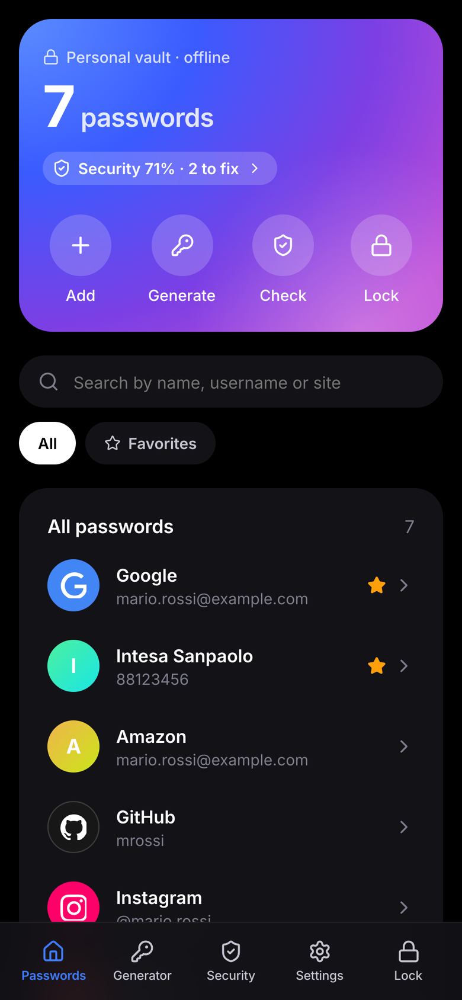
  &nbsp;
  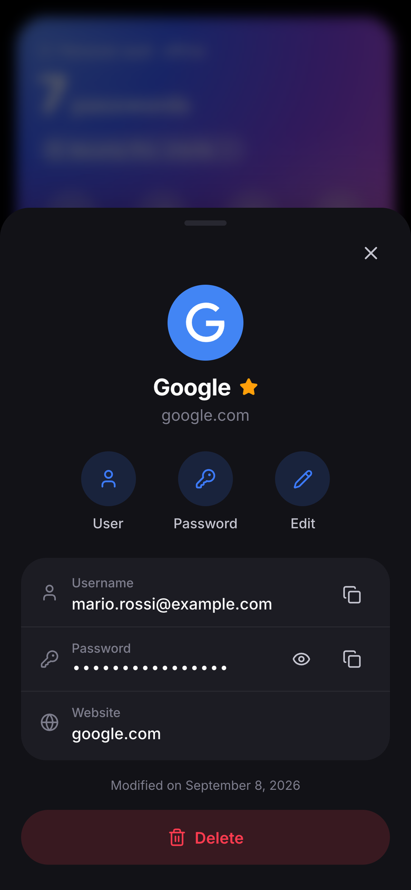
  &nbsp;
  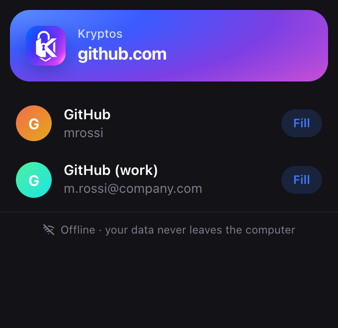
</p>

> Screenshots use sample data.

```
crates/core                 Rust: crypto, vault, generator, URL matching, CSV import, security analysis
crates/native-host          Native Messaging relay (browser ⇄ app), bundled with the app as a sidecar
apps/desktop                Tauri 2 app shared between desktop and mobile
  src/                      React UI (the same one on every platform)
  src-tauri/src/            Rust commands, browser bridge (desktop), autofill JNI (Android)
  src-tauri/gen/android/    Android project: AutofillService in Kotlin
extension/                  MV3 browser extension (Chrome, Arc, Brave, Edge, Firefox)
apps/desktop/brand/         Source logo + make-icons.py (regenerates every icon)
```

## Development

Requirements: Rust (rustup), Node 20+. For Android: Android Studio (SDK + NDK).

```bash
cd apps/desktop && npm install && npm run tauri dev
```

**Design preview in the browser** (fake data, no Rust): `npm run dev`, then open
http://127.0.0.1:1420. The master password is `password`.

Core tests:

```bash
cargo test -p kryptos-core
```

### Build

```bash
cd apps/desktop && npx tauri build            # macOS .app / .dmg (includes the native host)
```

```bash
cd apps/desktop && npx tauri android build --apk --target aarch64
```

Android needs `ANDROID_HOME`, `NDK_HOME` and `JAVA_HOME`. The JDK bundled with Android Studio works:
`/Applications/Android Studio.app/Contents/jbr/Contents/Home`.

**Signing Android releases.** Create the key once, outside the repository (keytool asks for the passwords):

```bash
keytool -genkeypair -v -keystore ~/kryptos-release.jks -alias kryptos -keyalg RSA -keysize 4096 -validity 10000
```

Then create `apps/desktop/src-tauri/gen/android/keystore.properties` (git-ignored) with `storeFile` (absolute
path to the `.jks`), `storePassword`, `keyAlias` and `keyPassword`. CI can point to another file with
`KRYPTOS_KEYSTORE_PROPERTIES`. Keep a backup of the `.jks` and its passwords: updates must be signed with the
same key. Without the file, release builds come out unsigned.

## Changing the logo

```bash
cd apps/desktop && python3 brand/make-icons.py /path/to/new-logo.png && npx tauri icon icon.png -o src-tauri/icons && python3 brand/make-icons.py --android-only
```

## Browser extension

1. `chrome://extensions` → Developer mode → *Load unpacked* → `extension/`
   (the ID is fixed: `jclbckdbmecjgoopnpchbijihdfeajkb`)
2. In the app: **Settings → Browser extension → Connect**, then restart the browser
3. On a login page: click the Kryptos icon, or ⌘⇧L

The extension's private key (`secrets/extension-key.pem`) is only needed to package a `.crx`. Don't
share it; it's excluded from git.

## Android autofill

Android Settings → Passwords & accounts → Autofill service → **Kryptos**.
Or, via adb:

```bash
adb shell settings put secure autofill_service com.kryptos.vault/.KryptosAutofillService
```

## Site logos

Entries show the logo of their website when one is available. Logos come from
[Simple Icons](https://simpleicons.org) (CC0), bundled with the app at build time: **no request is
ever made to fetch an icon**, so nobody can learn which sites you have accounts on. Sites without a
logo keep the coloured initial. All trademarks and logos belong to their respective owners and are used
only to identify the sites.

## License

[GPL-3.0-or-later](LICENSE). You can use, study, modify and redistribute Kryptos. Modified versions you
distribute must stay open source under the same license.
